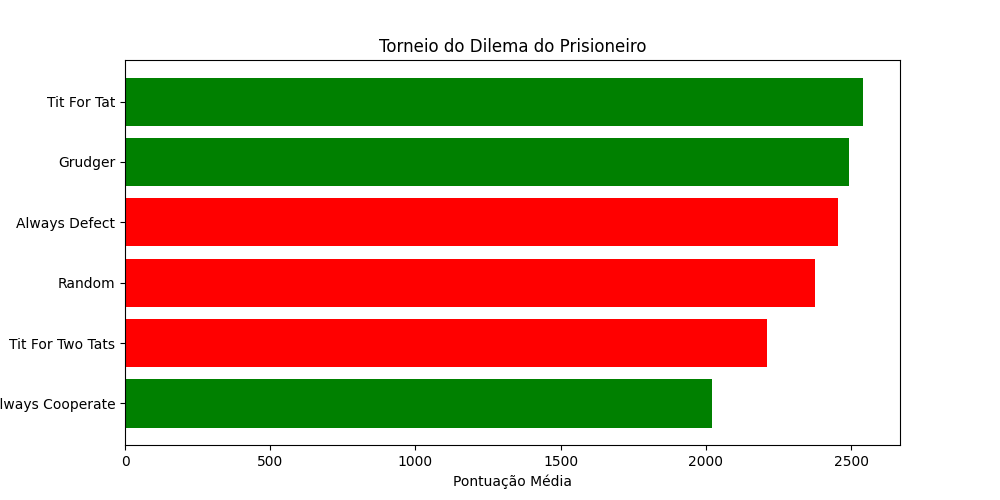

# Torneio do Dilema do Prisioneiro



Bem-vindo ao **Torneio do Dilema do Prisioneiro**! Este projeto simula interações entre estratégias clássicas do dilema do prisioneiro em um ambiente competitivo, revelando como cooperação, traição e adaptação influenciam resultados em cenários repetidos. Ideal para entusiastas de teoria dos jogos, educação e análise estratégica.

---

## Contexto e Objetivos

O **dilema do prisioneiro** é um paradoxo fundamental na teoria dos jogos que explora o conflito entre interesse individual e benefício coletivo. Desenvolvido por Albert W. Tucker nos anos 1950, ganhou relevância com os torneios de Robert Axelrod nos anos 1980, onde estratégias como **"Tit For Tat"** se destacaram por equilibrar reciprocidade e simplicidade.

### Objetivos do Projeto:
- **Simular Interações Estratégicas**: Modelar confrontos entre algoritmos com diferentes filosofias (cooperação, traição, adaptação).
- **Educação em Teoria dos Jogos**: Demonstrar conceitos como equilíbrio de Nash, cooperação emergente e evolução de estratégias.
- **Análise Quantitativa**: Comparar desempenho de estratégias através de pontuações acumuladas e visualização gráfica.
- **Aplicações Práticas**: Inspirar soluções em áreas como economia, biologia evolutiva e design de algoritmos colaborativos.

### Público-Alvo:
- Estudantes e professores de ciências sociais, economia e computação.
- Pesquisadores interessados em simulações de sistemas complexos.
- Desenvolvedores que buscam implementar lógicas de tomada de decisão em IA.

---

## Estratégias Implementadas

Cada estratégia encapsula um comportamento único, refletindo filosofias distintas de interação:

| Estratégia          | Comportamento                          | Categoria   | Exemplo Histórico/Prático                |
|----------------------|----------------------------------------|-------------|------------------------------------------|
| **Tit For Tat**      | Começa cooperando, imita última jogada | Good Guy    | Vencedor do torneio de Axelrod (1980)    |
| **Always Cooperate** | Sempre coopera                         | Good Guy    | Alianças diplomáticas estáveis           |
| **Tit For Two Tats** | Só retalia após 2 traições seguidas    | Good Guy    | Negociações com margem para erro         |
| **Always Defect**    | Sempre trai                            | Bad Guy     | Monopólios agressivos                    |
| **Grudger**          | Perdoa até a primeira traição          | Bad Guy     | Sistemas de justiça com "três strikes"   |
| **Random**           | Escolhas aleatórias                    | Neutro      | Táticas de diversão em jogos online      |
| **Adaptive**         | Ajusta tática baseada em histórico     | Adaptativo  | Algoritmos de mercado financeiro         |

**Categorias**:
- **Good Guys**: Estratégias que priorizam cooperação inicial e reciprocidade.
- **Bad Guys**: Estratégias agressivas ou com retaliação irreversível.
- **Neutros/Adaptativos**: Comportamentos imprevisíveis ou dinâmicos.

---

## Regras e Dinâmica do Torneio

### Sistema de Pontuação
Os jogadores acumulam pontos por rodada conforme a matriz clássica:

| Ação Jogador 1 | Ação Jogador 2 | Pontos (J1, J2) | Cenário Equivalente           |
|----------------|----------------|-----------------|-------------------------------|
| Cooperar       | Cooperar       | (3, 3)          | Cooperação mútua              |
| Cooperar       | Trair          | (0, 5)          | "Sucker's Payoff" vs. traição |
| Trair          | Cooperar       | (5, 0)          | Exploração bem-sucedida       |
| Trair          | Trair          | (1, 1)          | Guerra desgastante            |

**Lógica da Pontuação**:
- **Recompensa por cooperação mútua (3,3)**: Incentivo à colaboração, mas com ganho menor que a exploração.
- **Tentação de trair (5,0)**: Benefício imediato, mas risco de retaliação futura.
- **Punição por traição mútua (1,1)**: Prejuízo garantido em conflitos contínuos.
- **"Sucker's Payoff" (0,5)**: Penalização por confiar em parceiros oportunistas.

### Estrutura do Torneio
1. **Combates em Round Robin**: Cada estratégia enfrenta todas as outras.
2. **Rodadas Dinâmicas**: Número de rodadas por confronto varia entre 50 e 200 (evita previsibilidade).
3. **Ranking Final**: Pontos totais determinam a classificação, exibida em terminal e gráfico.

---

## Como Executar

### Pré-requisitos
- Python 3.8+
- Bibliotecas: `matplotlib`, `numpy`

```bash
pip install -r requirements.txt
```

### Executando o Torneio
```python
from torneio import Torneio, TitForTat, AlwaysDefect, Grudger

# Configure suas estratégias
estrategias = [
    TitForTat(nome="TitForTat (Agressivo)"),
    AlwaysDefect(),
    Grudger(),
]

# Inicie o torneio com 100 rodadas (fixas) para debug
torneio = Torneio(estrategias, rodadas_min=100, rodadas_max=100)
torneio.executar()
torneio.exibir_resultados()
```

**Saída Esperada**:
```
Ranking Final:
1. Adaptive: 1200 pontos
2. Tit For Tat: 1150 pontos
3. Grudger: 900 pontos
...
Gráfico salvo em 'resultados.png'
```

### Personalização Avançada
- **Adicione Novas Estratégias**: Herde da classe `Estrategia` e implemente `decidir()`.
- **Ajuste Parâmetros**: Modifique o intervalo de rodadas, penalidades ou recompensas.
- **Simulações em Massa**: Use `multi_torneio.py` para executar múltiplos torneios e analisar consistência.

---

## Análises e Insights

### Resultados Típicos
- **"Tit For Tat"** frequentemente lidera em ambientes mistos, equilibrando cooperação e defesa.
- **"Always Defect"** domina em torneios curtos, mas falha em cenários prolongados devido a retaliações.
- **Estratégias Adaptativas** performam bem contra oponentes diversificados, mas podem sucumbir a padrões caóticos (ex: Random).

### Lições Aplicáveis
1. **Reciprocidade é Sustentável**: Cooperação inicial com retaliação justa maximiza ganhos a longo prazo.
2. **Ambiente Influencia Comportamento**: Torneios com mais rodadas favorecem cooperadores.
3. **Diversidade Estratégica**: Sistemas com múltiplas táticas evitam domínio de um único comportamento.

---

## Contribuição e Expansão

Este projeto é open-source! Contribuições são bem-vindas:

1. **Novas Estratégias**: Implemente "Forgiving Tit For Tat", "Pavlov" ou "Testador".
2. **Recursos de Visualização**: Adicione gráficos de tendência, heatmaps de interação ou análise estatística.
3. **Otimização**: Melhore o desempenho para simulações com milhares de estratégias.

```python
class NovaEstrategia(Estrategia):
    def decidir(self, rodada, historico):
        # Lógica personalizada aqui
        return ACAO.COOPERAR if rodada % 2 == 0 else ACAO.TRAIR
```

---

## Referências e Leitura Adicional

- Axelrod, R. (1984). *The Evolution of Cooperation*. Basic Books.
- Wikipedia: [Dilema do Prisioneiro](https://pt.wikipedia.org/wiki/Dilema_do_prisioneiro)
- Stanford Encyclopedia of Philosophy: [Game Theory](https://plato.stanford.edu/entries/game-theory/)

**Licença**: MIT. Use, modifique e compartilhe livremente.